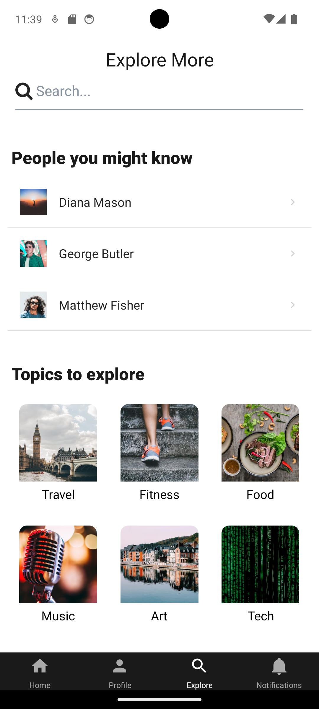
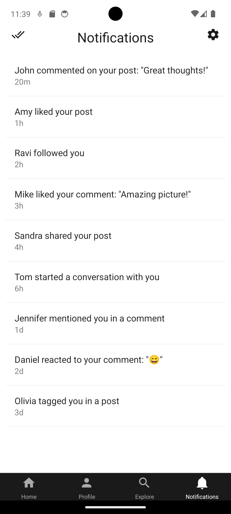

# Social Media App - Suzpect

This is a simple social media app that i built using React Native and Expo.

   

## Description

This project was built as a way to learn React Native. It includes features like a home screen with a feed of posts, a profile page with bio, gallery and activity, a notifications screen, and the ability to add new posts.

No backend has been added to the project as of yet.
## Setup and Installation

To get started with this project, do the following:

1. Clone the repository: `git clone https://github.com/Weibeck/social-media-react-app-suzpect`
2. Navigate to the project directory: `cd repository`
3. Install the dependencies: `npm install`
4. Start the project: `npm start`

## Usage

This app allows users to view a feed of posts on the home screen. Users can also add new posts by clicking on the 'New Post' button.

## Contributions

Contributions are welcome. Feel free to open a pull request or branch from this project.

## License

[MIT](https://choosealicense.com/licenses/mit/)
